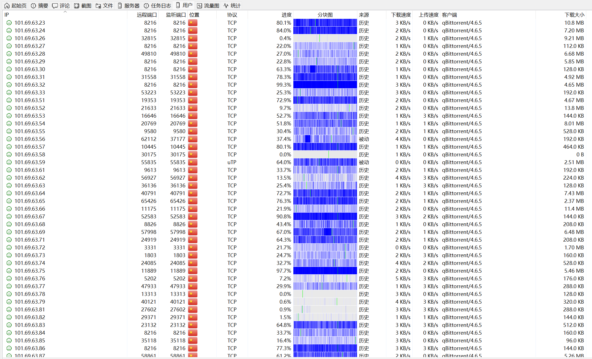
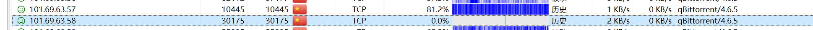

# BTN-Collected-Rules

由 BTN 网络统计分析得出的可被安全的加入系统防火墙屏蔽的 IP 地址列表。

## 如何使用

你可以直接在 PeerBanHelper 规则订阅页面选择性订阅这些规则（或者干脆直接订阅 combine/all.txt 大合集）。  
当然，你也可以配合路由器/网关 ACL 或防火墙规则，直接在网关处掐断这些 IP 的连接。

## 订阅链接

以下链接默认均为 `combine/all.txt` 的链接，如果您需要分开订阅，请自行修改。

* [Github Raw (推荐，可能需要科学)](https://raw.githubusercontent.com/PBH-BTN/BTN-Collected-Rules/main/combine/all.txt)
* [CloudFlare Pages (和上面保持同步更新)](https://bcr.pbh-btn.ghorg.ghostchu-services.top/combine/all.txt)
* [jsdelivr (部分地区可能有污染)](https://fastly.jsdelivr.net/gh/PBH-BTN/BTN-Collected-Rules@master/combine/all.txt)

## 鸣谢

感谢所有加入 BTN 威胁防护网络计划的所有成员。本仓库的所有 IP 数据均来自使用 PBH 并加入了 BTN 计划的成员提交的匿名数据而整理分析得出的。  
如果这些信息对您有所帮助，请考虑也[加入 BTN 计划](https://github.com/PBH-BTN/PeerBanHelper/wiki/BTN-%E7%BD%91%E7%BB%9C)，并贡献自己的一份力量。

## 更新

这些 IP 地址通过人工的方式不定期手动更新，请关注 commits 是否有新的提交，并视情况更新 IP 集。

## IP 规则说明

* `combine/all.txt` 包含下列所有规则
* `hp_torrent.txt` 包含被观测到的 `hp/torrent` 的 IP 地址
* `dt_torrent.txt` 包含被观测到的 `dt/torrent` 的 IP 地址
* `go.torrent dev 20181121.txt` 包含被观测到的百度网盘离线下载的 IP 地址
* `0xde-0xad-0xbe-0xef.txt` 包含被观测到的 `ޭ__` 乱码客户端的 IP 地址
* `123pan.txt` 包含被观测到使用 `offline-download (devel) (anacrolix/torrent unknown)` 的 IP 地址，此 UA 由 123 云盘使用
* `gitlab.i.ljyun.cn-hangzhou-monitoring.txt` 包含被观测到使用 `gitlab.i.ljyun.cn/hangzhou/monitoring (devel) (anacrolix/torrent v1.55.0)` 的 IP 地址，此特征 Peers 使用较为固定的 IP 段刷流
* `progress-rewind.txt` 包含了被观测到为进度重置/回退的 IP 地址，这通常意味着恶意刷流（该 IP 集的内容不会增量，而是每次替换）
* `random-peerid.txt` 包含了全随机 PeerID IP 地址列表，这是对 BT 网络的破坏，绝对恶意的行为[(ref)](https://github.com/PBH-BTN/PeerBanHelper/issues/309)
* `multi-dial.txt` 包含被观测到/用户报告的多拨下载的 IP 地址，这些 IP 段下批量部署大量客户端并进行吸血活动
  * 
  * 
  * 

---

[[Github 仓库]](https://github.com/PBH-BTN/BTN-Collected-Rules)  
Powered by CloudFlare Pages
